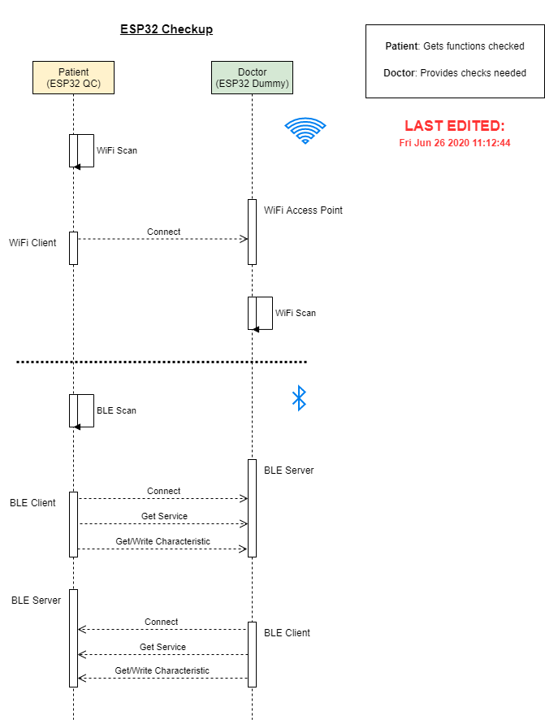
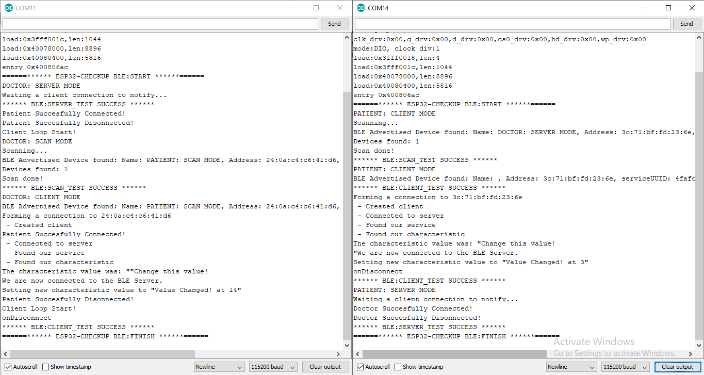

# ESP32 Checkup: BLE

This firmware is a simple tool that can be used to do quality control by checking the basic functions WiFi and BLE of any ESP32. It is designed with 2 seperate roles, the patient, and the doctor, hence it should be used side-by-side with another ESP32. The patient is the target that will be checked of it's functionalities whether or not it will fail in any of the tasks or succeed, whilst the doctor should be the one already known to be working fine. Please prepare both ESP32 and place them within close proximity.

## How it works:
1. Open up Arduino IDE, and flash the firmware to each seperate ESP32
2. Open up Serial Monitor to see the current testing
3. Reset boot Doctor, it should be in standby (being WiFi Access Point mode, waiting to be accessed by a client)
4. Reset boot Patient
5. Wait for the test to end

## Diagram:

## Results:
